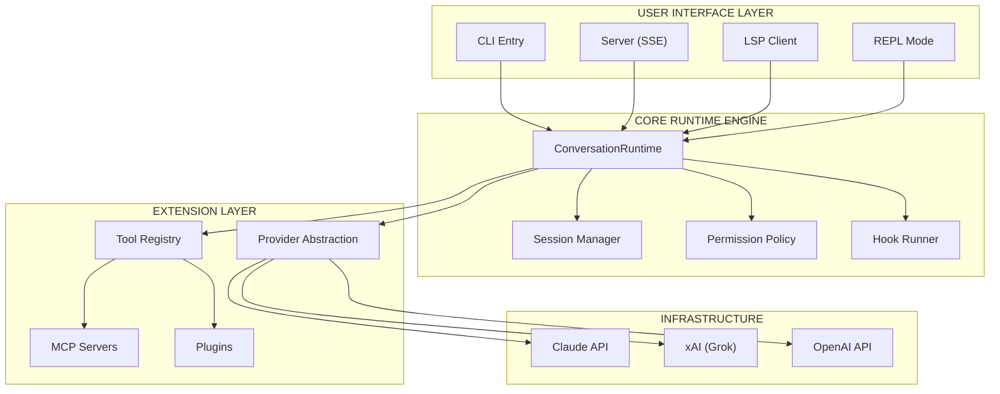
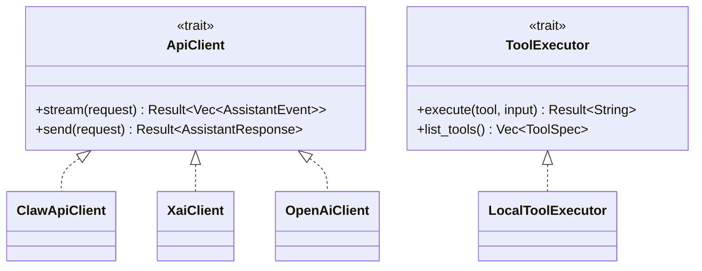
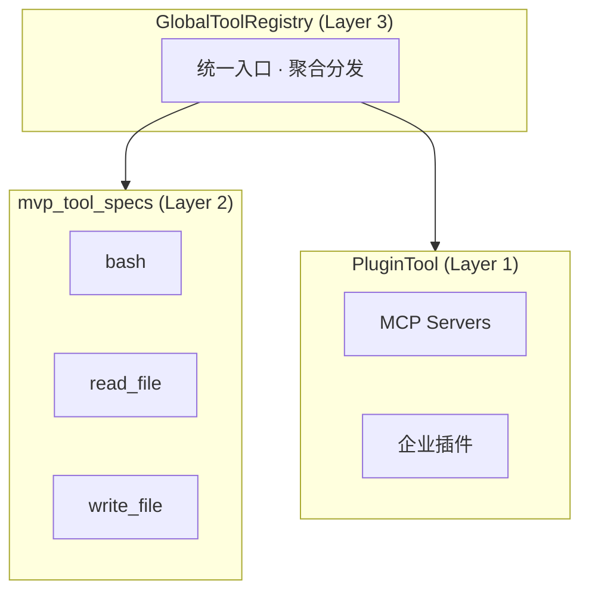
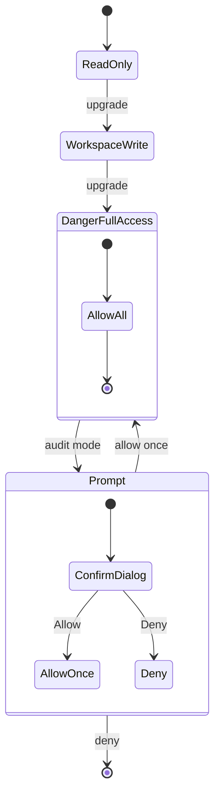
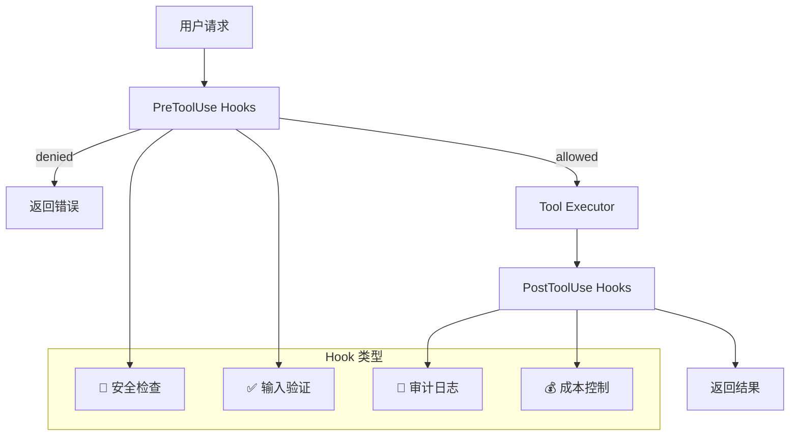
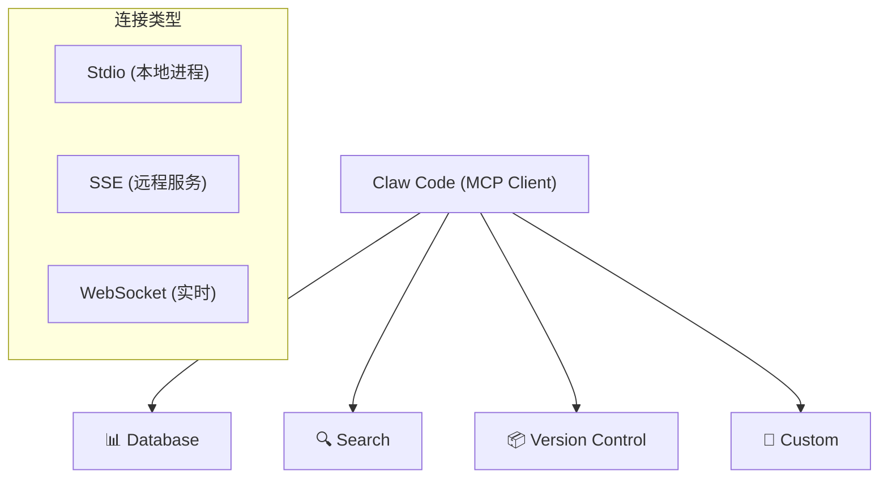
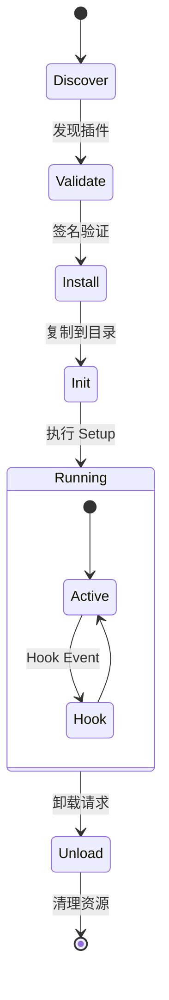

# Claw Code 架构深度解析：AI Agent 系统设计的技术实践

> *AI 模型: minimax-m2.5 | 生成时间: 2026-04-02*
>
> *GitHub: https://github.com/ultraworkers/claw-code | 2026年3月开源，星标数 2 小时内突破 50K*

---

## 架构全景图



---

## 一、项目背景与定位

Claw Code 是一款面向开发者的高级 AI 编程 Agent，其核心定位是 **"Better Harness Tools, not merely storing the archive"**（更好的工具 harness，而非仅仅存储归档代码）。

### 1.1 技术演进

| 版本 | 技术栈 | 特点 |
|------|--------|------|
| v1 | TypeScript | 闭源，快速迭代 |
| 过渡 | Python | 广覆盖，易部署 |
| v2 | Rust | 性能最优，内存安全 |

### 1.2 为什么选择 Rust？

| 考量维度 | TypeScript | Python | Rust |
|---------|-----------|--------|------|
| **性能** | 中等 | 较低（GIL） | 极高 |
| **内存安全** | 运行时 | 运行时 | 编译期保证 |
| **并发模型** | 事件循环 | asyncio | 原生 async |

---

## 二、核心设计模式深度解析

### 2.1 对话运行时 — 依赖倒置原则的极致实践

#### AI 架构师视角：为什么选择 Trait 泛型？

传统 AI Agent 系统通常将 API 客户端、工具执行器硬编码在运行时中，导致更换 AI 提供商需要修改核心代码，单元测试难以 mock 外部依赖。

Claw Code 通过 Trait 抽象实现了运行时与具体实现的完全解耦：



**设计收益**：
- ✅ 高度可测试性（Mock 客户端注入）
- ✅ 零厂商锁定（任何实现 ApiClient 的客户端可用）
- ✅ 组合自由（运行时可以动态选择客户端）

**权衡取舍**：
- ⚠️ 编译期复杂度增加
- ⚠️ 需要理解 Rust Trait 系统

#### 场景化讲解：多提供商工作流

假设用户要求 Claw Code 使用 Claude 生成代码骨架，然后使用 GPT-4 进行代码审查，最后使用 Grok 生成文档：

```rust
// 初始化运行时（注入具体实现）
let runtime = ConversationRuntime::new(
    ClawApiClient::new("claude-opus-4-6"),
    LocalToolExecutor::new(),
    PermissionPolicy::default()
);

// 执行工作流 — 代码无需修改，运行时自动选择正确的 Provider
for step in workflow.steps() {
    runtime.execute_step(step).await?;
}
```

---

### 2.2 工具系统 — 分层架构的工程美学

#### AI 架构师视角：三层架构的模块化设计



| 层级 | 职责 | 示例 |
|------|------|------|
| **Layer 3** | 统一入口、命名空间隔离 | GlobalToolRegistry |
| **Layer 2** | 最小可行工具集、核心能力 | bash, read_file, write_file |
| **Layer 1** | 外部扩展、动态加载 | MCP 服务器、企业插件 |

#### 场景化讲解：企业工具治理

```rust
// 企业工具配置示例
let registry = GlobalToolRegistry::new();

// 设置工具可见性策略（白名单模式）
registry.set_visibility_policy(VisibilityPolicy::Whitelist(vec![
    "read_file", "write_file", "grep", "glob",
]));

// 工具调用拦截
registry.on_tool_call(|tool_name, input| {
    audit_logger.log(tool_name, input)?;
    security_check(tool_name)?;
    Ok(())
});
```

---

### 2.3 权限模型 — 零信任架构的实践

#### AI 架构师视角：精细化权限控制



**权限级别**：

| 级别 | 说明 | 使用场景 |
|------|------|---------|
| ReadOnly | 仅读取文件 | 生产环境 |
| WorkspaceWrite | 读写工作区 | 受限开发 |
| DangerFullAccess | 完全访问 | 本地开发 |
| Prompt | 每次询问 | 审计环境 |
| Allow | 允许所有 | 特殊授权 |

#### 场景化讲解：多环境权限配置

```yaml
# 开发环境
permission_mode: DangerFullAccess

# 审计环境
permission_mode: Prompt
audit_enabled: true
require_reason: true

# 生产环境
permission_mode: ReadOnly
allowed_tools: [read_file, glob, grep]
```

---

### 2.4 Hook 系统 — 责任链模式的优雅实现

#### AI 架构师视角：开放-封闭原则的实践

Hook 系统允许开发者在不修改核心代码的情况下拦截和修改 Agent 的行为：



#### 场景化讲解：企业级 Hook 应用

```bash
#!/bin/bash
# hooks/pre_check.sh — 执行前安全检查
DANGEROUS_PATTERNS=("rm -rf /" "curl.*\|.*sh" ":(){:|:&}:")

for pattern in "${DANGEROUS_PATTERNS[@]}"; do
    if echo "$COMMAND" | grep -qE "$pattern"; then
        echo "SECURITY_ALERT: Dangerous pattern detected"
        exit 1  # 阻止执行
    fi
done
```

---

### 2.5 多提供商支持 — 消除厂商锁定

#### AI 架构师视角：Provider 抽象

| 模型前缀 | 提供商 | 环境变量 |
|---------|--------|---------|
| claude-* | Claw API | ANTHROPIC_API_KEY |
| grok-* | xAI | XAI_API_KEY |
| gpt-* | OpenAI | OPENAI_API_KEY |

#### 场景化讲解：智能成本优化

```rust
pub fn select_model(&self, task: &Task) -> String {
    match self.estimate_complexity(task) {
        Complexity::Trivial => self.select_cheapest(&["gpt-4o-mini", "claude-haiku"]),
        Complexity::Simple => self.select_fastest(&["gpt-4o", "claude-sonnet"]),
        Complexity::Medium => self.select_balanced(&["gpt-4-turbo", "claude-opus"]),
        Complexity::Complex => self.select_smartest(&["claude-opus-4", "grok-3"]),
    }
}
```

---

### 2.6 MCP 集成 — 生态连接的标准化

#### AI 架构师视角：协议化的生态连接



#### 场景化讲解：企业 MCP 配置

```yaml
mcp_servers:
  - name: "enterprise-docs"
    type: "sse"
    url: "https://docs.internal.company.com/mcp"

  - name: "jira"
    type: "stdio"
    command: "npx @company/jira-mcp"
```

---

### 2.7 会话压缩 — 有限上下文的无限策略

#### AI 架构师视角：智能上下文管理

当上下文接近 token 限制时，系统自动压缩历史会话：

| 压缩前 | 压缩后 | 节省 |
|--------|--------|------|
| 185K tokens | 15K tokens | 92% |

**压缩策略**：
1. 评估当前 token 使用量
2. 判断是否需要压缩
3. 生成智能摘要（保留工具调用、错误信息）
4. 保留最近 N 条消息完整

#### 场景化讲解：大型重构项目

```
压缩后摘要示例：
───────────────────────────────────────────────
<summary>
Conversation summary:
- Phase 1: 分析了 45 个文件，识别出 4 个模块
- Phase 2: 创建了 auth-service/(12 文件), billing-service/(8 文件)
- Phase 3: 12 个单元测试通过，3 个集成测试失败
- 当前重点：修复 billing-service 中的 auth token 验证
</summary>
───────────────────────────────────────────────
```

---

### 2.8 插件系统 — 企业级扩展的基石



---

## 三、Slash 命令系统

采用声明式命令注册，使得命令系统可扩展、可测试、可文档化：

```rust
const SLASH_COMMAND_SPECS: &[SlashCommandSpec] = &[
    SlashCommandSpec { name: "help", aliases: &["h", "?"], ... },
    SlashCommandSpec { name: "compact", aliases: &["compress"], ... },
    SlashCommandSpec { name: "branch", aliases: &["branches"], category: Git, ... },
    SlashCommandSpec { name: "test", ... },
    SlashCommandSpec { name: "build", ... },
    // ... 20+ 命令
];
```

---

## 四、项目上下文发现

系统会自动发现项目根目录的配置文件：

| 优先级 | 文件路径 | 说明 |
|--------|---------|------|
| 1 | CLAW.md | 项目级配置 |
| 2 | CLAW.local.md | 本地覆盖 |
| 3 | .claw/CLAW.md | 子目录配置 |
| 4 | .claw/instructions.md | 详细指令 |

---

## 五、关键设计启示

1. **Trait 泛型解耦** — 运行时与具体实现完全解耦，便于测试和替换
2. **分层架构** — GlobalToolRegistry → mvp_tool_specs → PluginTool
3. **权限安全模型** — 分级权限控制，运行时权限提升需要确认
4. **Hook 拦截机制** — PreToolUse/PostToolUse 支持安全和审计需求

---

## 六、与其他主流框架的对比

| 特性 | Claw Code | Claude Code | OpenCode |
|------|-----------|-------------|----------|
| **语言** | Rust | TypeScript | Go |
| **多提供商** | ✅ 原生 | ❌ | ❌ |
| **Hook 系统** | ✅ Pre/Post | ✅ | ❓ |
| **插件系统** | ✅ 进行中 | ❌ | ❓ |
| **MCP 支持** | ✅ 完整 | ✅ | ❓ |
| **会话压缩** | ✅ 智能 | ✅ | ❓ |
| **权限模型** | ✅ 分层 | 基础 | ❓ |

---

## 七、潜在的演进方向

### 7.1 多 Agent 协作

从单 Agent 演进出 Agent 池：CodeAgent（生成代码）、TestAgent（运行测试）、DocsAgent（编写文档）。

### 7.2 增量编译集成

与 watchman、rust-analyzer 集成，实现文件变化自动检测和增量编译验证。

### 7.3 云原生部署

支持远程运行（Server 模式）、WebSocket 实时协作、分布式任务队列。

---

## 八、总结

Claw Code 展示了构建企业级 AI Agent 系统的完整技术栈：

1. **运行时架构**：基于 Trait 的泛型设计，实现高度解耦
2. **安全模型**：分层的权限控制和 Hook 拦截机制
3. **扩展性**：插件系统和 MCP 协议支持
4. **工程实践**：Rust 实现的性能与内存安全保证
5. **开发者体验**：Slash 命令、CLAW.md 项目上下文、REPL 交互

作为 AI 架构师，我认为 Claw Code 最值得学习的地方在于：

- **抽象层次的选择**：Trait 抽象在灵活性和复杂度之间取得了良好的平衡
- **安全优先的设计**：默认危险模式，让开发者意识到安全风险
- **生态连接的开放性**：MCP 支持使其能够融入更大的 AI 工具生态

---

*参考来源：https://github.com/ultraworkers/claw-code*
